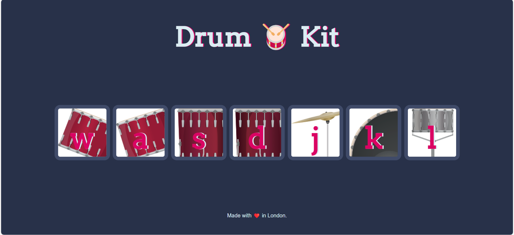
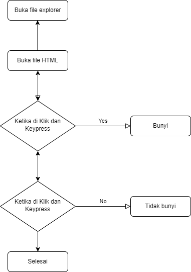

# Drum Kit 🥁

Drum Kit is a simple web-based application that allows users to play various drum sounds using keys on the keyboard or by clicking buttons on the screen.

## Demo



## Feature

- Play drum sounds using the keyboard (`w`, `a`, `s`, `d`, `j`, `k`, `l`).
- Button animation when pressed.
- Interactive display.

## Flowchart


## How to use

1. Clone repositori ini.
   ```bash
   git clone https://github.com/rizallfrm/FSW2-23-09-2024-drum-kit.git


# Thank You!!!